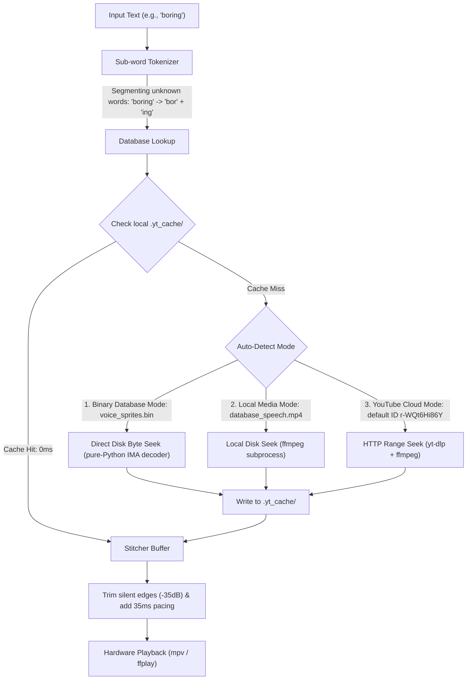

# YTVoice: Cloud-Hosted Concatenative TTS Playhead Engine

[](https://opensource.org/licenses/MIT)
[](https://www.python.org/downloads/)
[](https://ffmpeg.org/)

A lightweight, multi-mode concatenative text-to-speech (TTS) playhead engine. It enables low-resource client devices (such as smart home hubs, Termux/Android nodes, Raspberry Pis, or IoT devices) to synthesize arbitrary spoken text on-the-fly. The engine features zero-config YouTube cloud streaming, low-memory local MP4 slicing, and high-performance local binary byte-seeking.

---

## 🐝 The "Bumblebee" Radio Design

Inspired by how the Autobot **Bumblebee** speaks by scanning radio frequencies and stitching audio fragments together, YTVoice treats local or remote video/audio databases as a single cohesive soundboard. 

By mapping word coordinates, the player seeks and slices precise fragments (syllables, words, or sub-words) and concatenates them with natural padding. This eliminates the need to host heavy, resource-intensive neural networks (like Piper or Tortoise-TTS) on small devices.



---

## 🛠️ System Setup & Installation

To run this repository on **Linux, macOS, Windows, or Termux (Android)**:

### 1. Install System Binaries
You must have `ffmpeg` (for slicing streams and local media) and `mpv` or `ffplay` (for audio hardware output) installed in your system's path.

* **Ubuntu/Debian**: `sudo apt install ffmpeg mpv`
* **macOS**: `brew install ffmpeg mpv`
* **Termux (Android)**: `pkg install ffmpeg mpv`

### 2. Pull the Git LFS Database (Required!)
`voice_sprites.bin` is a **238 MB [Git LFS](https://git-lfs.com) object**. The file you get from a normal clone is only a 134-byte LFS *pointer*, so binary mode will fail with `[!] Failed to extract ... from binary database` on every word until you pull the real file.

```bash
# Must be done ONCE after cloning (both git-lfs and network required)
git lfs install        # registers the LFS smudge/clean hooks
git lfs pull           # downloads the real 238 MB voice_sprites.bin
```

* **Debian/Ubuntu**: `sudo apt install git-lfs`
* **Termux (Android)**: `pkg install git-lfs`
* Verify success — the file should be ~238 MB, not 134 bytes:
  ```bash
  ls -la voice_sprites.bin   # expected: 238736226 bytes
  ```

### 3. Install Python Dependencies
Install the core Python packages:

```bash
git clone https://github.com/acadiemedia/ytvoice.git
cd ytvoice

# Install playback dependencies (Zero compilation, safe for Termux)
pip install -r requirements.txt
```

**One-shot installer (recommended):** `./install.sh` does everything for you — Git LFS setup + database pull/skip, PEP 668 handling, dependency install, and an offline smoke test:
```bash
git clone https://github.com/acadiemedia/ytvoice.git
cd ytvoice
./install.sh
```

**PEP 668 externally-managed environments (Debian 12+ / Ubuntu 23.10+ / official Python images)**:
Pip refuses to install with `error: externally-managed-environment`. Use either:

```bash
# Option A: override the guard (simple, this project installs pure-Python deps only)
pip install --break-system-packages -r requirements.txt

# Option B: isolated virtual environment (recommended)
python3 -m venv .venv && source .venv/bin/activate
pip install -r requirements.txt
```

*(Note: For Python 3.13+, pip will automatically install the `audioop-lts` backport package since the standard `audioop` module was removed in Python 3.13).*

---

## 🚀 The Three Playback Modes

The player (`src/player.py`) automatically detects which mode to use based on the files present in your directory:

### Mode 1: Zero-Config YouTube Cloud Mode
If no local files are found, the engine automatically defaults to streaming from the official YouTube database video (`r-WQt6Hi86Y`). It downloads the subtitles track in-memory and queries only the specific audio byte-ranges needed.

```bash
# Instant playback out-of-the-box (no local files needed)
python3 src/player.py "hello steve online active"
```
* **Specific Video Streaming**: You can specify another YouTube Video ID/URL:
  ```bash
  python3 src/player.py "hello steve" --youtube YOUR_YOUTUBE_VIDEO_ID
  ```

### Mode 2: High-Performance Binary Database Mode (Default Offline)
If `voice_sprites.bin` and `voice_sprites.bin.index.json` are present in your current directory, the engine boots into high-speed binary seek mode. It queries exact byte offsets from the disk with **0ms seek latency** and zero external subprocess calls.
* **No extra dependencies needed**: Binary mode decodes the IMA ADPCM sprites with a built-in pure-Python decoder — only `pydub` is required (no `numpy`/`soundfile`):
  ```bash
  python3 src/player.py "hello steve online active"
  ```
* To force binary mode explicitly (when it wouldn't auto-detect), pass `--bin`:
  ```bash
  python3 src/player.py "hello steve" --bin voice_sprites.bin
  ```

### Mode 3: Local MP4 Media Mode (Low-Memory Offline)
If you have `database_speech.mp4` and `database_speech.srt` locally, the player will seek inside the local file using `ffmpeg`. It reads the file on disk instead of loading it entirely into RAM, keeping the memory footprint under **15 MB** (perfect for smart speakers).
* **Bootstrap Offline Files**: You can download these files locally from YouTube automatically:
  ```bash
  python3 src/player.py --download r-WQt6Hi86Y
  ```
  This creates `database_speech.srt` and `database_speech.mp4` in your folder. Play offline using:
  ```bash
  python3 src/player.py "hello steve online active"
  ```

---

## 🧠 Smart Engine Features

### 1. Greedy Sub-Word Segmentation Tokenizer
If you speak a composite or unknown word (such as `"boring"` or `"haba"`), the engine recursively matches the longest dictionary prefixes against the database:
* `"boring"` $\rightarrow$ segments and stitches `"bor"` + `"ing"`.
* `"haba"` $\rightarrow$ segments and stitches `"ha"` + `"ba"`.
This expands your vocabulary coverage dynamically without manually compiling new audio sets.

### 2. On-Demand Local Caching
When in YouTube mode, each fetched word segment is saved locally inside a `.yt_cache/` directory. Subsequent playback of the same word reads it directly from disk. If all words in a sentence are cached, the engine **bypasses YouTube and the network entirely**, starting playback in under 50ms.

### 3. YouTube Phrase Voice ("Bumblebee" Real Speech)
Phrases can be mined directly from real YouTube speech. `tools/add_youtube_phrases.py` searches YouTube, downloads the auto-caption word-timeline for each hit video, locates exact phrase occurrences, and records `(video_id, start_ms, end_ms)` candidates into `phrase_db.json`. The player then splices those exact spoken moments out of the source videos and stitches multi-phrase sentences together — playing back *actual humans* saying the words, not synthesized approximations.

```bash
# Search YouTube and build a candidate slice for each phrase
python3 tools/add_youtube_phrases.py "i love you" "thanks for watching" --commit

# Harvest every listed phrase from specific videos the search missed
python3 tools/add_youtube_phrases.py "every single second" --video BdTGkd_sbNs --commit

# Slice n-grams from a full sentence
python3 tools/add_youtube_phrases.py --sentence "i love you every single second" --min-words 3 --max-words 6 --commit
```

Then speak with automatic longest-phrase matching, falling back to word sprites:

```bash
python3 src/player.py "i love you every single second" --bin voice_sprites.bin --index voice_sprites.bin.index.json
```

* Phrase matching is **greedy-longest-first**: if a spoken n-gram exists in `phrase_db.json`, that exact real speech slice wins over word-sprite stitching.
* Slices from many different videos mix seamlessly: each clip is resampled to 16 kHz mono and loudness-normalized (~ -18 dBFS), then edge-trimmed.
* Phrase slices are cached in `.yt_cache/phrases/`, so repeat playback never touches the network.

---

## 🛠️ CLI Flags Help

Run `python3 src/player.py --help` to see all available execution flags:

| Flag | Default | Description |
|---|---|---|
| `sentence` | (Optional) | The sentence to synthesize and speak. |
| `--youtube` | `r-WQt6Hi86Y` | YouTube Video ID or URL to stream from on-the-fly. Defaults to the official database when passed without an argument. |
| `--srt` | `database_speech.srt` | Path to the local SRT subtitle timing mapping. |
| `--audio` | `database_speech.mp4` | Path to the local MP4 video/audio database. |
| `--cache-dir` | `.yt_cache` | Directory to cache retrieved audio slices (YouTube mode). |
| `--bin` | `voice_sprites.bin` | Path to the binary ADPCM database file. |
| `--index` | `voice_sprites.bin.index.json` | Path to the JSON binary index mapping. |
| `--download` | `None` | Bootstraps both `srt` and `mp4` locally from YouTube for offline usage. |
| `--phrase-db` | `phrase_db.json` | Path to the phrase database built by `tools/add_youtube_phrases.py`. |
| `--no-play` | `False` | Export the stitched audio to the temp file without playing it. |

---

## ❗ Troubleshooting & Known Issues

### 1. `[!] Failed to extract '<word>' from binary database` for EVERY word
**Cause:** `voice_sprites.bin` is only a 134-byte Git LFS pointer — the real 238 MB object was never downloaded.
**Fix:** `git lfs install && git lfs pull` (see [Step 2](#2-pull-the-git-lfs-database-required)). Confirm with `ls -la voice_sprites.bin` (should be `238736226` bytes).

### 2. `error: externally-managed-environment` when running `pip install`
**Cause:** PEP 668 guard on modern Linux distros.
**Fix:** `pip install --break-system-packages -r requirements.txt`, or create a venv first (see [Step 3](#3-install-python-dependencies)).

### 3. YouTube mode never activates even with no local files
**Cause:** Binary mode auto-detection takes **precedence**. If `voice_sprites.bin` + `voice_sprites.bin.index.json` exist in the working directory, binary mode is always chosen.
**Fix:** Force YouTube cloud mode explicitly:
```bash
python3 src/player.py "hello steve" --youtube
```
Or run from a directory that does not contain the `.bin`/`.index.json` files.

### 4. Explicit `--bin` flag was ignored (fixed)
**Cause (fixed in `ece339e`):** Passing `--bin voice_sprites.bin` used to make the auto-detection block skip *and* leave binary mode off, so the engine fell through to YouTube streaming ("No local database assets found. Defaulting to YouTube..."). It was impossible to force binary mode via CLI.
**Fix:** Now `--bin` forces binary mode directly (and `--index` defaults to `voice_sprites.bin.index.json` when omitted):
```bash
python3 src/player.py "hello steve" --bin voice_sprites.bin
```

### 5. No audio output / silent playback on Termux/Android PRoot
**Cause:** PRoot sandboxes have no direct audio device access — the PRoot `mpv`/`ffplay` cannot open an audio sink.
**Fix (already built in):** The engine auto-detects and routes playback through the **host** Termux binary via the linker64 bridge:
```python
/system/bin/linker64 /data/data/com.termux/files/usr/bin/mpv --no-video <file>
```
Requirements:
* Termux `mpv` installed in the host: `pkg install mpv`
* If the host mpv path is different, edit `play_audio()` in `src/player.py:211` or export the audio to WAV and play it with your own player:
  ```bash
  python3 src/player.py "hello steve"     # prints: exported to /tmp/playhead_proof.wav
  ```
* On normal Linux/macOS the engine falls back to system `mpv`, then `ffplay`, then pure-Python `pydub.playback` — no linker64 involved.

### 6. Word plays as a "beep" instead of speech
**Cause:** The word (or any of its sub-word segments) is not present in the subtitle/binary index. YTVoice falls back to a 150 ms sine beep.
**Fix:** Pick a different word, or expand the database with the tools:
```bash
python3 tools/add_atoms.py          # sub-word atoms for full English recombination
python3 tools/add_common_words.py   # top ~30k English words
python3 tools/add_names.py          # common names
```

### 7. A word that IS in the index still won't extract
Check the offsets are within the real file size (pointers/trimmed files cause out-of-range reads):
```bash
python3 -c "
import json, os
idx = json.load(open('voice_sprites.bin.index.json'))
size = os.path.getsize('voice_sprites.bin')
print('file size:', size)
bad = [w for w,(o,l) in idx.items() if o+l > size]
print('out-of-range entries:', len(bad))
"
```
If there are thousands of bad entries, the `.bin` was not fully pulled (see #1).

### 8. `git lfs pull` downloads nothing / smudge filter hangs
* Confirm the repo uses LFS: `git lfs ls-files` should list `voice_sprites.bin`.
* Confirm git-lfs is on PATH: `which git-lfs` (on Termux it lives at `/data/data/com.termux/files/usr/bin/git-lfs`).
* If only `git lfs install` ran but no file appeared, run `git lfs pull` again, then verify byte size (see #1).

---

## 📄 License

This project is licensed under the MIT License - see the [LICENSE](LICENSE) file for details.
