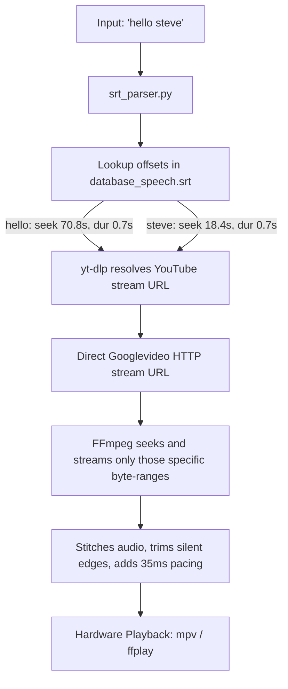

# YTVoice: Cloud-Hosted Playhead TTS Engine

[](https://opensource.org/licenses/MIT)
[](https://www.python.org/downloads/)
[](https://ffmpeg.org/)

A lightweight, portable concatenative text-to-speech (TTS) playhead engine. It enables low-resource client devices (such as smart home hubs, Raspberry Pi servers, or IoT nodes) to speak arbitrary sentences on-the-fly by streaming and stitching tiny audio fragments directly from a YouTube-hosted video database.

---

## 🐝 The "Bumblebee" Radio Design

This engine is inspired by how the Autobot **Bumblebee** speaks: scanning radio channels and stitching recorded broadcasts together on-the-fly to form coherent sentences. 

Instead of hosting heavy, resource-intensive neural networks (like Piper or Tortoise-TTS) on your local device, YTVoice treats a single YouTube video as a remote soundboard. By querying only the specific byte-ranges of individual words from the cloud, your device gains access to a full vocabulary database with **0% local storage overhead** and **near-zero CPU/RAM footprint**.



---

## 🛠️ System Setup & Installation

To run this repository on **Linux, macOS, Windows, or Termux (Android)**, configure the following:

### 1. Install System Binaries
You must have `ffmpeg` (for audio byte-range streaming) and `mpv` or `ffplay` (for audio hardware output) installed in your system's path.

* **Ubuntu/Debian**: `sudo apt install ffmpeg mpv`
* **macOS**: `brew install ffmpeg mpv`
* **Termux**: `pkg install ffmpeg mpv`

### 2. Install Python Dependencies
Clone the repository and install the Python packages:

```bash
git clone https://github.com/acadiemedia/ytvoice.git
cd ytvoice
pip install -r requirements.txt
```

---

## 🚀 How to Run

### 1. YouTube Cloud Streaming Mode
To run in cloud mode, you do **not** need the local 100MB video file. Simply download the `.srt` coordinate mapping, specify a YouTube Video ID/URL, and the client will fetch the word slices from the network:

```bash
python3 src/player.py "hello steve online active" --youtube YOUR_YOUTUBE_VIDEO_ID
```
*(The engine uses HTTP range requests to download only the few kilobytes needed for each word, minimizing latency and bandwidth).*

### 2. Local File Mode (Offline)
For offline local testing, place both the compiled `database_speech.srt` and the `database_speech.mp4` video file in your directory and run:

```bash
python3 src/player.py "hello steve online active"
```

### 3. Compile Your Own Database (Optional)
To stitch a directory of raw voice sprites (ADPCM or WAV format) into a unified H.264 video with 250ms guard bands:

```bash
python3 src/compiler.py
```

---

## 📄 License

This project is licensed under the MIT License - see the [LICENSE](LICENSE) file for details.
